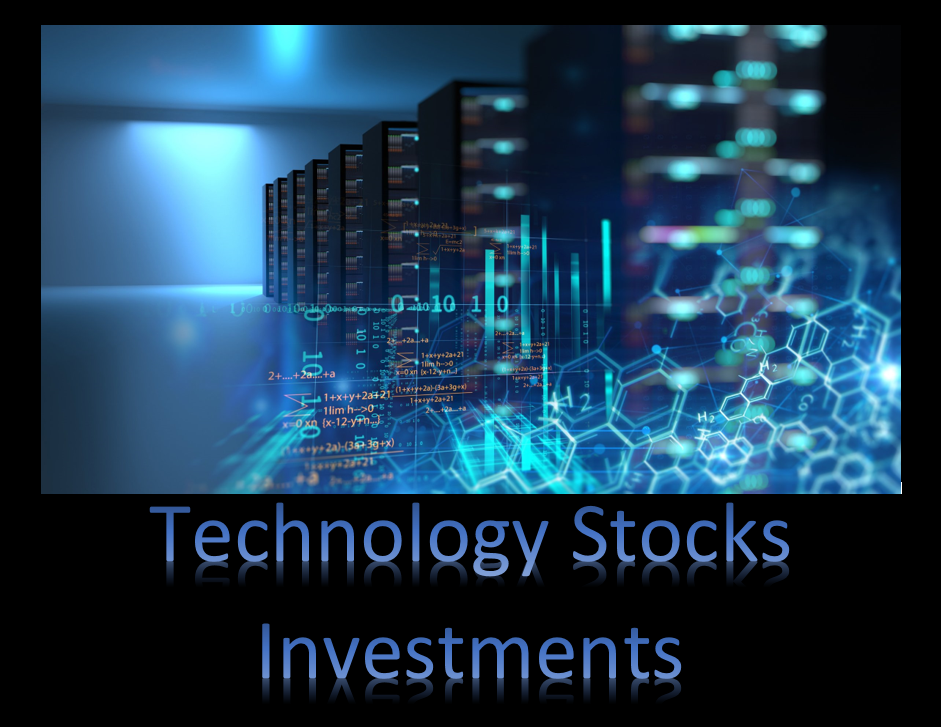

<h1 align="center">Technology Investment</h1>

#### This project involves long-term investment analysis to determine which technology company is a good choice for long-term investment. The analysis includes examining historical data spanning 10 years, calculating performance measurements, conducting back-testing, forecasting, and utilizing the Capital Asset Pricing Model. Various trading strategies are tested, aiming to identify stocks with the lowest risks and highest returns.

#### Use income, balance, and cashflow statements and historical price in Excel, Python, and R for Stocks Analysis

# Prerequistes  
#### Python 3.7  
#### Jupyter Notebook Python 3.7   
#### Excel 2016  
#### R  

### Stock Tickers:
ADBE Adobe Inc.  
AMAT Applied Materials, Inc.  
AMD Advanced Micro Devices, Inc.  
AVGO Broadcom Inc.  
BABA Alibaba Group Holding Limited  
CSCO Cisco Systems, Inc.  
ETSY Etsy, Inc.  
GOOGL Alphabet Inc.  
INTC Intel Corporation  
LRCX Lam Research Corporation  
LUMN Lumen Technologies, Inc.  
META Meta Platforms, Inc.  
MSFT Microsoft Corporation  
MU Micron Technology, Inc.  
NFLX Netflix, Inc.  
NVDA NVIDIA Corporation  
PYPL PayPal Holdings, Inc.  
QCOM QUALCOMM Incorporated  
STX Seagate Technology Holdings plc  
TSM Taiwan Semiconductor Manufacturing Company Limited  

## Author:  
### Tin Hang  

## Disclaimer
## 🔴 This is not get rich quick.  
## 🔴 This is not financial advisor.   
## 🔴 This is for researching and educational purposes.  
### This is not financial advisor. Do your own research. Do not use this code for investing or trading in the stock market. However, if you are interest in the stock market, you should read books investment, trading, stock market, and finance. Consult a professional investment advisor before making any investment decisions. This educational purposes.  
